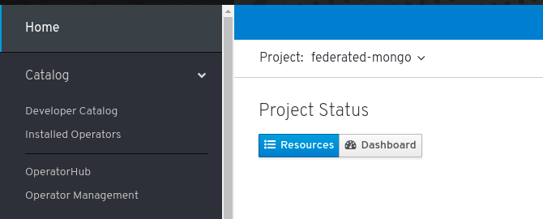
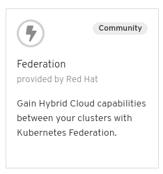
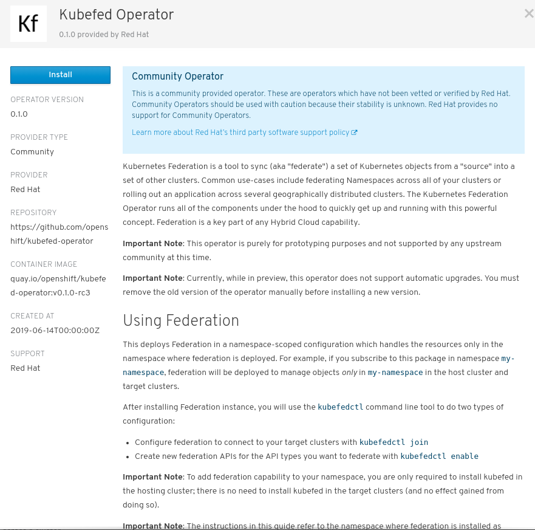

# Federated MongoDB
The files within this directory are used with the Federation V2 operator to show
MongoDB running on multiple OpenShift clusters. An accompanying video
is here. This demonstration uses 3 OpenShift 4 clusters. It is assumed that 3 OpenShift
clusters have already been deployed using of the deployment mechanisms defined at
https://cloud.openshift.com.

## Creating a Namespace and Deploying the Operator
The first step is to decide which of the clusters will run the Federation Operator.
Only one cluster runs the federation-controller-manager.

A new project of *federated-mongo* is created within the OpenShift UI on cluster east1. Once the project is created the next step is to deploy the operator.

Select OperatorHub</br>



Once the OperatorHub loads click Federation </br>


Once Federation has been chosen, information about the Operator will appear. It is
important to take note of the Operator Version as this will be needed when deciding
which version of Kubefed2 to use.

Select Install</br>


Subscribe to the Federation Operator in the *federated-mongo* namespace by clicking the
*Subscribe* button.


Back at the command line run the following command looking for the status of Succeeded

NOTE: This may take a few minutes

## Kubeconfig
Specific items are required to be configured within the `kubeconfig` file before
federating clusters. By default the context is defined as *admin* in the `kubeconfig` file for OpenShift
4 clusters.  The directories below east-1, east-2, and west-2 represent the directories
containing independent OpenShift 4 clusters and the `kubconfig` relating to those OpenShift deployments.
Your cluster names may be different.
~~~sh
sed -i 's/admin/east1/g' east-1/auth/kubeconfig
sed -i 's/admin/east2/g' east-2/auth/kubeconfig
sed -i 's/admin/west2/g' west-2/auth/kubeconfig
export KUBECONIFG=`pwd`/east-1/auth/kubeconfig:`pwd`/east-2/auth/kubeconfig:`pwd`/west-2/auth/kubeconfig
oc config view --flatten > aws-east1-east2-west2
export KUBECONFIG=`pwd`/aws-east1-east2-west2
oc config set-context east1
~~~

## Install the kubefed2 binary

The `kubefed2` tool manages federated cluster registration. Download the
v0.0.8 release and unpack it into a directory in your PATH (the
example uses `$HOME/bin`):

NOTE: The version may change as the operator matures. Verify that the version of
Federation matches the version of `kubefed2`.

~~~sh
curl -LOs https://github.com/kubernetes-sigs/federation-v2/releases/download/v0.0.8/kubefed2.tgz
tar xzf kubefed2.tgz -C ~/bin
rm -f kubefed2.tgz
~~~

Verify that `kubefed2` is working:
~~~sh
kubefed2 version

kubefed2 version: version.Info{Version:"v0.0.8", GitCommit:"0d12bc3d438b61d9966c79a19f12b01d00d95aae", GitTreeState:"clean", BuildDate:"2019-04-11T04:26:34Z", GoVersion:"go1.11.2", Compiler:"gc", Platform:"linux/amd64"}
~~~

## Joining Clusters
Now that the `kubefed2` binary has been acquired the next step is joining the clusters.
`kubefed2` binary utilizes the contexts and clusters within `kubeconfig` when defining the clusters.

Using the `kubeconfig` file that was generated, verify the Operator has been successfully deployed.
~~~sh
$ oc get csv -n federated-mongo
NAME                DISPLAY      VERSION   REPLACES   PHASE
federation.v0.0.8   Federation   0.0.8                Succeeded
~~~
The next step is to federate the clusters using `kubefed2`.
~~~sh
kubefed2 join east1 --host-cluster-context east1 --add-to-registry --v=2 --federation-namespace=federated-mongo --registry-namespace=federated-mongo --limited-scope=true
kubefed2 join east2 --host-cluster-context east1 --add-to-registry --v=2 --federation-namespace=federated-mongo --registry-namespace=federated-mongo --limited-scope=true
kubefed2 join west2 --host-cluster-context east1 --add-to-registry --v=2 --federation-namespace=federated-mongo --registry-namespace=federated-mongo --limited-scope=true

for type in namespaces clusterroles.rbac.authorization.k8s.io deployments.apps ingresses.extensions jobs replicasets.apps secrets serviceaccounts services persistentvolumeclaims configmaps clusterrolebindings.rbac.authorization.k8s.io
do
  kubefed2 enable $type --federation-namespace federated-mongo --registry-namespace federated-mongo
done
~~~

Validate that the clusters are defined as `federatedclusters`.
~~~sh
oc get federatedclusters -n federated-mongo
NAME    READY
east1   True
east2   True
west2   True
~~~

## Creating Certificates
This demonstration uses MongoDB with SSL enabled. The example below will create a
generic CA, key, and certificate. The following binaries are required.

* [cssl](https://pkg.cfssl.org/R1.2/cfssl_linux-amd64)
* [cfssljson](https://pkg.cfssl.org/R1.2/cfssljson_linux-amd64)

~~~sh
curl -LOs https://pkg.cfssl.org/R1.2/cfssl_linux-amd64
mv cfssl_linux-amd64 ~/bin/cfssl
chmod +x ~/bin/cfssl
curl -LOs https://pkg.cfssl.org/R1.2/cfssljson_linux-amd64
mv cfssljson_linux-amd64 ~/bin/cfssljson
chmod +x ~/bin/cfssljson
~~~

Create the following files to be used for certificate signing. The `ca-csr.json` and `mongodb-csr.json` should reflect values that may be relevant to the organization or OpenShift clusters.
**ca-config.json**
```json
{
  "signing": {
    "default": {
      "expiry": "8760h"
    },
    "profiles": {
      "kubernetes": {
        "usages": ["signing", "key encipherment", "server auth", "client auth"],
        "expiry": "8760h"
      }
    }
  }
}
```
**ca-csr.json**
```json
{
  "CN": "Kubernetes",
  "key": {
    "algo": "rsa",
    "size": 2048
  },
  "names": [
    {
      "C": "US",
      "L": "Austin",
      "O": "Kubernetes",
      "OU": "TX",
      "ST": "Texas"
    }
  ]
}
```
**mongodb-csr.json**
```json
{
  "CN": "kubernetes",
  "key": {
    "algo": "rsa",
    "size": 2048
  },
  "names": [
    {
      "C": "US",
      "L": "Austin",
      "O": "Kubernetes",
      "OU": "TX",
      "ST": "Texas"
    }
  ]
}
```
The routes used for the MongoDB endpoints must be defined as certificates will be generated against them. The following  routes will be used as the endpoints for MongoDB and be populated within OpenShift as routes.

~~~sh
SERVICE_NAME=mongo
ROUTE_CLUSTER1=mongo-east1.apps.east-1.example1.com
ROUTE_CLUSTER2=mongo-east2.apps.east-2.example1.com
ROUTE_CLUSTER3=mongo-west2.apps.west-2.example1.com
SANS="localhost,localhost.localdomain,127.0.0.1,${ROUTE_CLUSTER1},${ROUTE_CLUSTER2},${ROUTE_CLUSTER3},${SERVICE_NAME},${SERVICE_NAME}.${NAMESPACE},${SERVICE_NAME}.${NAMESPACE}.svc.cluster.local"
# Generate CA
cfssl gencert -initca ca-csr.json | cfssljson -bare ca
# Generate MongoDB Certs
cfssl gencert -ca=ca.pem -ca-key=ca-key.pem -config=ca-config.json -hostname=${SANS} -profile=kubernetes mongodb-csr.json | cfssljson -bare mongodb
# Combine Key and Cert
cat mongodb-key.pem mongodb.pem > mongo.pem
~~~

## Deploying MongoDB
There are many different types of federated objects but they are somewhat similar to those
non-federated objects. For more information about federated objects see the following  [examples](https://github.com/kubernetes-sigs/federation-v2/tree/master/example/sample1) and
the [user guide](https://github.com/kubernetes-sigs/federation-v2/blob/master/docs/userguide.md).


The first step is to clone the demo code to your local machine:
~~~sh
git clone https://github.com/openshift/federation-dev.git
cd federation-dev/federated-mongodb
~~~

Before deploying MongoDB the yaml files need to be updated to define the certificates that
were created as well as the routing endpoints that will be used. Ensure the values of `/tmp/mongo.pem` and `/tmp/ca.pem` reflect the path where the `pem` files were created.
~~~sh
# Define the pem
sed -i "s/mongodb.pem: .*$/mongodb.pem: $(openssl base64 -A < ../../mongo.pem)/" 01-mongo-federated-secret.yaml
sed -i "s/ca.pem: .*$/ca.pem: $(openssl base64 -A < ../../ca.pem)/" 01-mongo-federated-secret.yaml
# Configure MongoDB Endpoints for the deployment
sed -i "s/primarynodehere/${ROUTE_CLUSTER1}:443/" 04-mongo-federated-deployment-rs.yaml
sed -i "s/replicamembershere/${ROUTE_CLUSTER1}:443,${ROUTE_CLUSTER2}:443,${ROUTE_CLUSTER3}:443/" 04-mongo-federated-deployment-rs.yaml
~~~

Now that the yaml files contain the `pem` and routes it is time to deploy the objects.
~~~sh
# Create secret with admin/access credentials
oc --context=east1 -n federated-mongo create -f 01-mongo-federated-secret.yaml
# Create service
oc --context=east1 -n federated-mongo create -f 02-mongo-federated-service.yaml
# Create persistent volume claim
oc --context=east1 -n federated-mongo create -f 03-mongo-federated-pvc.yaml
# Create deployment
oc --context=east1 -n federated-mongo create -f 04-mongo-federated-deployment-rs.yaml
~~~

The next step is deploy the routes which will be used as the public endpoints for
the MongoDB deployment.
~~~sh
# East1 Route
oc --context=east1 -n federated-mongo create route passthrough mongo --service=mongo --port=27017 --hostname=${ROUTE_CLUSTER1}
# East2 Route
oc --context=east2 -n federated-mongo create route passthrough mongo --service=mongo --port=27017 --hostname=${ROUTE_CLUSTER2}
# West2 Route
oc --context=west2 -n federated-mongo create route passthrough mongo --service=mongo --port=27017 --hostname=${ROUTE_CLUSTER3}
~~~

Verify that the pods are running and label the MongoDB primary pod.
~~~sh
# Wait until east1 mongodb deployment is ready
oc --context=east1 -n federated-mongo get deployment mongo
# Wait until east2 mongodb deployment is ready
oc --context=east2 -n federated-mongo get deployment mongo
# Wait until west2 mongodb deployment is ready
oc --context=west2 -n federated-mongo get deployment mongo
# Select Primary MongoDB pod
MONGO_POD=$(oc --context=east1 -n federated-mongo get pod --selector="name=mongo" --output=jsonpath='{.items..metadata.name}')
# Label primary pod
oc --context=east1 -n federated-mongo label pod $MONGO_POD replicaset=primary
# Wait 30 seconds so the replicaset is configured
sleep 30
# Get replicaset status
oc --context=east1 -n federated-mongo exec $MONGO_POD -- bash -c 'mongo --norc --quiet --username=admin --password=$MONGODB_ADMIN_PASSWORD --host localhost admin --tls --tlsCAFile /opt/mongo-ssl/ca.pem --eval "rs.status()"'
~~~

Using the output above it is possible to identify the primary and secondary MongoDB
servers.

~~~json
	"members" : [
		{
			"_id" : 0,
			"name" : "mongo-east1.apps.east-1.example1.com:443",
			"health" : 1,
			"state" : 1,
			"stateStr" : "PRIMARY",
			"uptime" : 112,
			"optime" : {
				"ts" : Timestamp(1556819163, 6),
				"t" : NumberLong(1)
			},
			"optimeDate" : ISODate("2019-05-02T17:46:03Z"),
			"syncingTo" : "",
			"syncSourceHost" : "",
			"syncSourceId" : -1,
			"infoMessage" : "could not find member to sync from",
			"electionTime" : Timestamp(1556819161, 1),
			"electionDate" : ISODate("2019-05-02T17:46:01Z"),
			"configVersion" : 1,
			"self" : true,
			"lastHeartbeatMessage" : ""
		},
		{
			"_id" : 1,
			"name" : "mongo-east2.apps.east-2.example1.com:443",
			"health" : 1,
			"state" : 2,
			"stateStr" : "SECONDARY",
			"uptime" : 30,
			"optime" : {
				"ts" : Timestamp(1556819163, 6),
				"t" : NumberLong(1)
			},
			"optimeDurable" : {
				"ts" : Timestamp(1556819163, 6),
				"t" : NumberLong(1)
			},
			"optimeDate" : ISODate("2019-05-02T17:46:03Z"),
			"optimeDurableDate" : ISODate("2019-05-02T17:46:03Z"),
			"lastHeartbeat" : ISODate("2019-05-02T17:46:19.469Z"),
			"lastHeartbeatRecv" : ISODate("2019-05-02T17:46:19.908Z"),
			"pingMs" : NumberLong(13),
			"lastHeartbeatMessage" : "",
			"syncingTo" : "mongo-east1.apps.east-1.example1.com:443",
			"syncSourceHost" : "mongo-east1.apps.east-1.example1.com:443",
			"syncSourceId" : 0,
			"infoMessage" : "",
			"configVersion" : 1
		},
		{
			"_id" : 2,
			"name" : "mongo-west2.apps.west-2.example1.com:443",
			"health" : 1,
			"state" : 2,
			"stateStr" : "SECONDARY",
			"uptime" : 30,
			"optime" : {
				"ts" : Timestamp(1556819163, 6),
				"t" : NumberLong(1)
			},
			"optimeDurable" : {
				"ts" : Timestamp(1556819163, 6),
				"t" : NumberLong(1)
			},
			"optimeDate" : ISODate("2019-05-02T17:46:03Z"),
			"optimeDurableDate" : ISODate("2019-05-02T17:46:03Z"),
			"lastHeartbeat" : ISODate("2019-05-02T17:46:20.730Z"),
			"lastHeartbeatRecv" : ISODate("2019-05-02T17:46:19.024Z"),
			"pingMs" : NumberLong(79),
			"lastHeartbeatMessage" : "",
			"syncingTo" : "mongo-east2.apps.east-2.example1.com:443",
			"syncSourceHost" : "mongo-east2.apps.east-2.example1.com:443",
			"syncSourceId" : 1,
			"infoMessage" : "",
			"configVersion" : 1
		}
	],
~~~

This concludes the deployment of MONGODB using Federation. This database cluster
can be used with the [pacman](../federated-pacman/README.md) application.
