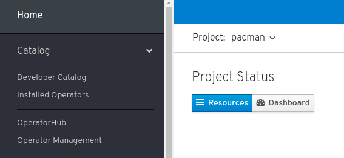
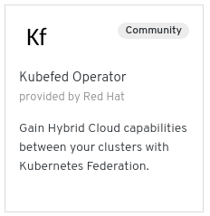
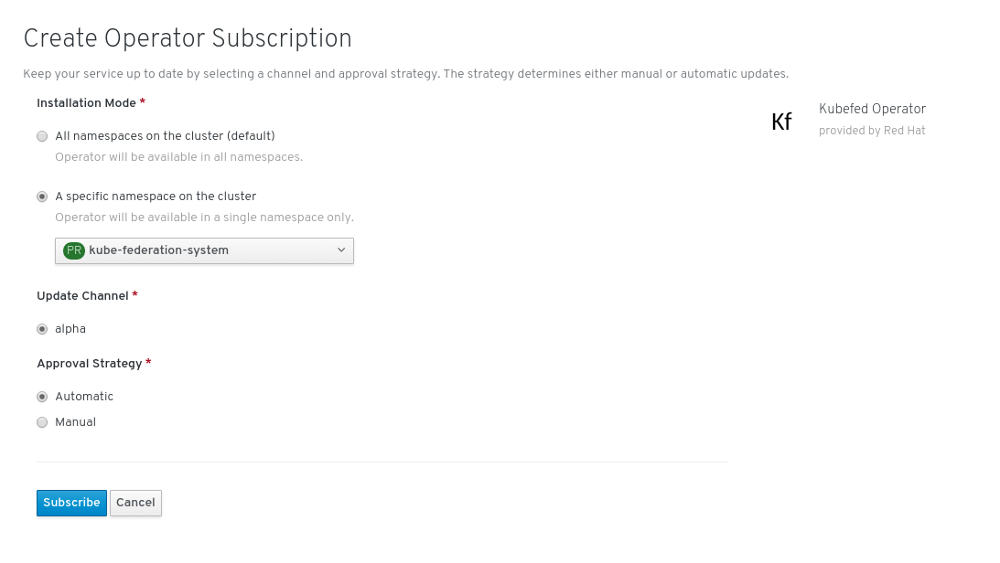

 # Federation Pacman
The files within this directory are used with the Federation operator to show
an application balancing and moving between OpenShift clusters. An accompanying video
is [here](https://youtu.be/avCPAJms3Fc) showing the 0.0.8 version of Kubefed. This demonstration uses 3 OpenShift 4 clusters. It is assumed that 3 OpenShift
clusters have already been deployed using of the deployment mechanisms defined at
https://cloud.openshift.com.

## Creating a Namespace and Deploying the Operator
The first step is to decide which of the clusters will run the Kubefed Operator.
Only one cluster runs the federation-controller-manager. This is incredibly important
because cluster based Kubefed and namespace based Kubefed should not run on the same cluster.

A new project of *kube-federation-system* needs to be created from the command line on cluster east2. Using the project of *kube-federation-system* allows for easy interaction
with the kubefed components as it is the default namespace when using cluster scoped Kubefed.

~~~sh
oc create ns kube-federation-system
~~~

From the OpenShift UI select the project *kube-federation-system* and select OperatorHub.

Select OperatorHub 

Once the OperatorHub loads click Kubefed  

Once Kubefed Operator has been chosen, information about the Operator will appear. It is
important to take note of the Operator Version as this will be needed when deciding
which version of Kubefedctl to use.

Select Install 

Choose the Installation Mode of "A specific namespace on the cluster" and  click the
*Subscribe* button.

## Kubeconfig
Specific items are required to be configured within the `kubeconfig` file before
federating clusters. By default the context is defined as *admin* in the `kubeconfig` file for OpenShift
4 clusters.  The directories below east-1, east-2, and west-2 represent the directories
containing independent OpenShift 4 clusters and the `kubconfig` relating to those OpenShift deployments.
Your cluster names may be different.
~~~sh
sed -i 's/admin/east1/g' east-1/auth/kubeconfig
sed -i 's/admin/east2/g' east-2/auth/kubeconfig
sed -i 's/admin/west2/g' west-2/auth/kubeconfig
export KUBECONFIG=`pwd`/east-1/auth/kubeconfig:`pwd`/east-2/auth/kubeconfig:`pwd`/west-2/auth/kubeconfig
oc config view --flatten > aws-east1-east2-west2
export KUBECONFIG=`pwd`/aws-east1-east2-west2
oc config set-context east1
~~~

## Install the `kubefedctl` binary

The `kubefedctl` tool manages federated cluster registration. Download the
v0.0.1.0-rc4 release and unpack it into a directory in your PATH (the
example uses `$HOME/bin`):

NOTE: The version may change as the operator matures. Verify that the version of
Kubefed matches the version of `kubefedctl`.

~~~sh
curl -LOs https://github.com/kubernetes-sigs/kubefed/releases/download/v0.1.0-rc4/kubefedctl-0.1.0-rc4-linux-amd64.tgz
tar xzf kubefedctl-0.1.0-rc4-linux-amd64.tgz -C ~/bin
rm -f kubefedctl-0.1.0-rc4-linux-amd64.tgz
~~~

Verify that `kubefedctl` is working:
~~~sh
kubefedctl version

kubefedctl version: version.Info{Version:"v0.1.0-rc4", GitCommit:"d188d227fe3f78f33d74d9a40b3cb701c471cc7e", GitTreeState:"clean", BuildDate:"2019-06-25T00:27:58Z", GoVersion:"go1.12.5", Compiler:"gc", Platform:"linux/amd64"}
~~~

## Enable the Kubefed Controller Manager
The Kubefed Controller Manager has to be enabled and deployed with the scope of
`Cluster` to manage cluster wide objects.

From the command line run the following command:
~~~sh
cat <<-EOF | oc apply -n kube-federation-system -f -
---
apiVersion: operator.kubefed.io/v1alpha1
kind: KubeFed
metadata:
  name: kubefed-resource
spec:
  scope: Cluster
---
EOF
~~~

## Joining Clusters
Now that the `kubefedctl` binary has been acquired the next step is joining the clusters.
`kubefedctl` binary utilizes the contexts and clusters within `kubeconfig` when defining the clusters.

Using the `kubeconfig` file that was generated, verify the Operator has been successfully deployed.
~~~sh
$ oc get csv -n kube-federation-system
NAME                      DISPLAY            VERSION   REPLACES   PHASE
kubefed-operator.v0.1.0   Kubefed Operator   0.1.0                Succeeded
~~~

Ensure that the kubefed-controller-manager is in the ready state.
~~~sh
$ oc get deployment -n federated-mongo
NAME                         READY   UP-TO-DATE   AVAILABLE   AGE
kubefed-controller-manager   2/2     2            2           48s
kubefed-operator             1/1     1            1           83s
~~~

The next step is to federate the clusters using `kubefedctl`.
~~~sh
kubefedctl join east1 --cluster-context east1 --host-cluster-context east2 --v=2
kubefedctl join east2 --cluster-context east2 --host-cluster-context east2 --v=2
kubefedctl join west2 --cluster-context west2 --host-cluster-context east2 --v=2
~~~

Validate that the clusters are defined as `kubefedclusters`.
~~~sh
oc get kubefedclusters -n kube-federation-system
NAME    READY
east1   True    20h
east2   True    20h
west2   True    20h
~~~

Enable the federating of specific objects.
~~~sp
for type in namespaces ingresses.extensions secrets serviceaccounts services configmaps persistentvolumeclaims deployments.apps clusterrolebindings.rbac.authorization.k8s.io clusterroles.rbac.authorization.k8s.io
do
  kubefedctl enable $type
done
~~~

## Deploying *Pacman*
Now that the clusters are federated it is time to deploy the *pacman* application.
There are many different types of federated objects but they are somewhat similar to those
non-federated objects. For more information about federated objects see the following  [examples](https://github.com/kubernetes-sigs/kubefed/tree/master/example/sample1) and
the [user guide](https://github.com/kubernetes-sigs/kubefed/blob/master/docs/userguide.md).

Clone the demo code to your local machine:
~~~sh
git clone https://github.com/openshift/federation-dev.git
cd federation-dev/federated-pacman/pacman-yaml
~~~

Modify the cluster names to reflect the names of the kubefedclusters defined above.
~~~sh
sed -i 's/feddemocl1/east1/g' ./*.yaml
sed -i 's/feddemocl2/east2/g' ./*.yaml
sed -i 's/feddemocl3/west2/g' ./*.yaml
~~~

The pacman namespace must be created and then defined as a federated namespace.
~~~sh
oc create ns pacman
kubefedctl federate namespace pacman
~~~

Validate the namespace exists in the three clusters.
~~~sh
for i in east1 east2 west2; do oc get project pacman --context $i; done
NAME     DISPLAY NAME   STATUS
pacman                  Active
NAME     DISPLAY NAME   STATUS
pacman                  Active
NAME     DISPLAY NAME   STATUS
pacman                  Active
~~~

For the *pacman* application, the file `pacman-federated-deployment-rs.yaml` needs to reflect the MongoDB endpoint. The MongoDB endpoint is used to save scores from the game.
Provide the value of the MongoDB server(s) to be used for the scores to be recorded
for the *pacman* game.
~~~sh
sed -i 's/replicamembershere/mongo-east1.apps.east-1.example1.com,mongo-east2.apps.east-2.example1.com,mongo-west2.apps.west-2.example1.com/g' 07-pacman-federated-deployment-rs.yaml
~~~

A value must be provided to be the publicly accessible address for the *pacman* application.
~~~sh
sed -i 's/pacmanhosthere/pacman.example1.com/g' 03-pacman-federated-ingress.yaml
~~~

Now deploy the *pacman* objects.
~~~sh
# Create the MongoDB secret
oc create -n pacman -f 01-mongo-federated-secret.yaml
# Create the service
oc create -n pacman -f 02-pacman-federated-service.yaml
# Create the ingress endpoint
oc create -n pacman -f 03-pacman-federated-ingress.yaml
# Create the pacman service serviceaccount
oc create -n pacman -f 04-pacman-federated-service-account.yaml
# Create the pacman cluster role
oc create -n pacman -f 05-pacman-federated-cluster-role.yaml
# Create the clusterrolebinding
oc create -n pacman -f 06-pacman-federated-cluster-role-binding.yaml
# Create the deployment
oc create -n pacman -f 07-pacman-federated-deployment-rs.yaml
~~~

## Deploying HAProxy
Due to DNS TTLs, HAProxy is used to manage traffic of the *pacman* application
running on the different clusters. The use of HAProxy allows for faster failover
than TTLs can. This lowers the potential downtime when moving the *pacman* application
on and off of clusters.

A `configmap` will define the endpoints that were created when we created the ingress endpoint
using `03-pacman-federated-ingress.yaml`

A value must be provided to be the publicly accessible address for the *pacman* application. Also,
it is required to specify the cluster and the address of the *pacman* application which is routed by the OpenShift
router.
~~~sh
cd ../haproxy-yaml
cp haproxy.tmpl haproxy
sed -i 's/<pacman_lb_hostname>/pacman.example1.com/g' haproxy
sed -i 's/<server1_name> <server1_pacman_route>:<route_port>/west2 pacman.apps.west-2.example1.com:80/g' haproxy
sed -i 's/<server2_name> <server2_pacman_route>:<route_port>/east2 pacman.apps.east-2.example1.com:80/g' haproxy
sed -i 's/<server3_name> <server3_pacman_route>:<route_port>/east1 pacman.apps.east-1.example1.com:80/g' haproxy
~~~

Create the `configmap` to be used by the HAProxy `deploymentconfig`.
~~~sh
oc create -n pacman configmap haproxy --from-file=haproxy
~~~

A load balancer `service` is used to create a cloud provider load balancer. The Load balancer provides a publicly
available endpoint that can be used to assign a DNS A record.
~~~sh
# Create the HAProxy service
oc -n pacman create -f haproxy-service.yaml
# Create the HAProxy deployment
oc -n pacman create -f haproxy-deployment.yaml
~~~

## DNS
This demonstration uses Route53 for DNS. The first step is to look up the value of
the load balancer service and then assign a DNS A record.
~~~sh
oc -n pacman get svc haproxy-lb-service
NAME         TYPE           CLUSTER-IP       EXTERNAL-IP                                                               PORT(S)        AGE
haproxy-lb-service   LoadBalancer   172.31.161.224   ae294119d6d0d11e9b8b10e1ce99fb1b-1020848795.us-east-1.elb.amazonaws.com   80:31587/TCP   86m
~~~

The next step is to provide the load balancer `EXTERNAL-IP` to a the DNS zone to allow for routing.

NOTE: The A record will point to the publicly accessible address for the *pacman* application.

Enter the value of the publicly accessible address and use an Alias to point to the
`haproxy-lb` load balancer `ELB`.

## Play the Game
The game should be available now at the publicly accessible address. Make sure to
save the high score at the end of the game. This shows the data being persisted back to
the database.

## Moving the Application
By patching the `federateddeployment` the application can be scheduled and unscheduled between the clusters. The step below remove the *pacman* application from all clusters except for east2. This is done by modifying the `federateddeployment`
~~~sh
oc --context=east2 -n pacman patch federateddeployment pacman --type=merge -p '{"spec":{"overrides":[{"clusterName":"west2","clusterOverrides":[{"path":"/spec/replicas","value":0}]},{"clusterName":"east1","clusterOverrides":[{"path":"/spec/replicas","value":0}]}]}}'
~~~

The above command states that there should be 0 replicas in both east1 and west2. To verify
no pods are running in the other clusters the following command can be ran.

~~~sh
oc get deployment pacman --context east1 -n pacman
NAME     READY   UP-TO-DATE   AVAILABLE   AGE
pacman   0/0     0            0           132m

oc get deployment pacman --context east2 -n pacman
NAME     READY   UP-TO-DATE   AVAILABLE   AGE
pacman   1/1     1            1           132m

oc get deployment pacman --context west2 -n pacman
NAME     READY   UP-TO-DATE   AVAILABLE   AGE
pacman   0/0     0            0           132m
~~~

To populate the application back to all clusters use patch the `federateddeployment` again specifying 1 replica for all clusters.
~~~sh
ooc --context=east2 -n pacman patch federateddeployment pacman --type=merge -p '{"spec":{"overrides":[{"clusterName":"west2","clusterOverrides":[{"path":"/spec/replicas","value":0}]},{"clusterName":"east1","clusterOverrides":[{"path":"/spec/replicas","value":0}]}]}}'
~~~

The most important thing to note during the modification of which clusters are running the
*pacman* application is that the scores persist regardless of which cluster the application is running and HAProxy always ensures the application is available.
