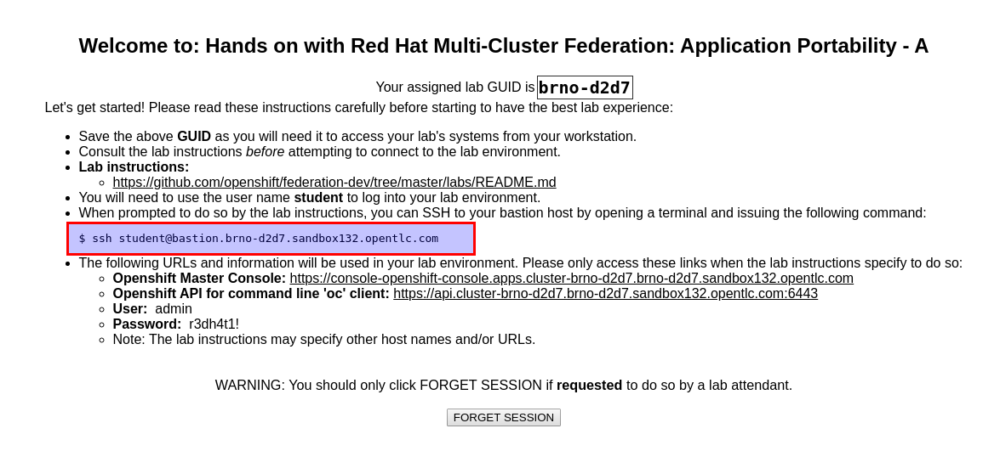

# Introduction and Prerequisites

This hands on lab is a simple deployment of [Kubefed Operator](https://operatorhub.io/operator/kubefed-operator) on multiple OpenShift
clusters. This lab will use the KubeFed operator above as well as the binary `kubefedctl`.
We will deploy cluster scoped KubeFed and deploy applications to multiple clusters using KubeFed Primitives.

# Accessing the ClientVM
All of the work will be completed using the ClientVM that you get from GuidGrabber for Cluster1 Environment. Let's go ahead an login into the ClientVM. Remember that login details are presented by GuidGrabber.

e.g:

For *sshing* in the ClientVM you can use your favorite ssh-client.

~~~sh
ssh student@clientvm.GUID.DOMAIN

e.g: ssh student@clientvm.d5fe.sandbox253.opentlc.com
~~~

At this point you should be logged in to the ClientVM and you should have the information for all three environment defined by the GuidGrabber.

During this lab we will utilize the `kubefedctl` binary to join the three clusters
as well as enable the required types and then use the `oc` command to deploy objects used for the lab.

We will use cfssl tooling when dealing with TLS certificates, `cfssl` and `cfssljson` binaries are already deployed for you.

## Verifications

**All verifications have to be run in ClientVM.**

Verify that [kubefedctl](https://github.com/kubernetes-sigs/kubefed/releases/tag/v0.1.0-rc4) is working:

~~~sh
kubefedctl version

kubefedctl version: version.Info{Version:"v0.1.0-rc4-dirty", GitCommit:"2dbec10d6bef12ebcd21744ccb50eb4e8cfcfeaa", GitTreeState:"dirty", BuildDate:"2019-07-19T23:38:14Z", GoVersion:"go1.12.5", Compiler:"gc", Platform:"linux/amd64"}
~~~

Verify that [cfssl](https://pkg.cfssl.org/R1.2/cfssl_linux-amd64) is working:

~~~sh
cfssl version

Version: 1.2.0
Revision: dev
Runtime: go1.6
~~~

Verify that [cfssljson](https://pkg.cfssl.org/R1.2/cfssljson_linux-amd64) is working:

~~~sh
cfssljson -help

Usage of cfssljson:
<OUTPUT OMITTED>
~~~

Verify that the lab content is available on the `ClientVM`:

~~~sh
ls -ld ~/federation-dev/labs
drwxrwxr-x. 3 student users 4096 Aug  1 16:20 /home/student/federation-dev/labs/
~~~

Next Lab: [Lab 2 - Configure OpenShift client context for cluster admin access](./2.md) 
Previous Lab: [Lab 0 - Accessing to the Lab Environment](./intro.md) 
[Home](../README.md)