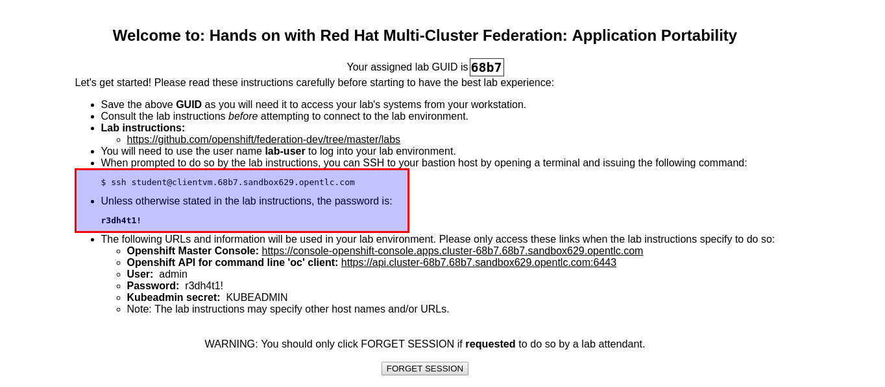

# Introduction and Prerequisites

This hands on lab is a deployment of [Argo CD](https://github.com/argoproj/argo-cd) which will be used to manage multiple OpenShift
clusters. This lab will use the Argo CD application as well as the binary `argocd`.

# Accessing the BastionVM
All of the work will be completed using the BastionVM that you get from GuidGrabber for Cluster1 Environment. Let's go ahead an login into the BastionVM. Remember that login details are presented by GuidGrabber.

e.g:

For *sshing* in the BastionVM you can use your favorite ssh-client.

~~~sh
ssh student@bastion.GUID.DOMAIN

e.g: ssh student@bastion.d5fe.sandbox253.opentlc.com
~~~

At this point you should be logged in to the BastionVM and you should have the information for all three environment defined by the GuidGrabber.

During this lab we will utilize the `argocd` binary to define the clusters and repositories in which the Argo CD deployment will manage. 

We will use [cfssl tooling](https://cfssl.org/) when dealing with TLS certificates, `cfssl` and `cfssljson` binaries are already deployed for you.

## Verifications

**All verifications have to be run in BastionVM.**

Verify that [argocd](https://github.com/argoproj/argo-cd/releases/download/v1.1.2/argocd-linux-amd64) is working:

~~~sh
argocd version

argocd: v1.3.6+89be1c9
  BuildDate: 2019-12-10T22:46:45Z
  GitCommit: 89be1c9ce6db0f727c81277c1cfdfb1e385bf248
  GitTreeState: clean
  GoVersion: go1.12.6
  Compiler: gc
  Platform: linux/amd64
argocd-server: v1.3.6+89be1c9
  BuildDate: 2019-12-10T22:47:48Z
  GitCommit: 89be1c9ce6db0f727c81277c1cfdfb1e385bf248
  GitTreeState: clean
  GoVersion: go1.12.6
  Compiler: gc
  Platform: linux/amd64
  Ksonnet Version: v0.13.1
  Kustomize Version: Version: {Version:kustomize/v3.2.1 GitCommit:d89b448c745937f0cf1936162f26a5aac688f840 BuildDate:2019-09-27T00:10:52Z GoOs:linux GoArch:amd64}
  Helm Version: v2.15.2
  Kubectl Version: v1.14.0
~~~

Verify that [cfssl](https://github.com/cloudflare/cfssl/blob/master/README.md#using-the-command-line-tool) is working:

~~~sh
cfssl version

Version: 1.2.0
Revision: dev
Runtime: go1.6
~~~

Verify that [cfssljson](https://github.com/cloudflare/cfssl/blob/master/README.md#using-the-command-line-tool) is working:

~~~sh
cfssljson -help

Usage of cfssljson:
<OUTPUT OMITTED>
~~~

Verify that the lab content is available on the `BastionVM`:

~~~sh
ls -ld ~/federation-dev/labs
drwxrwxr-x. 3 student users 4096 Aug  1 16:20 /home/student/federation-dev/labs/
~~~

Next Lab: [Lab 2 - Configure OpenShift client context for cluster admin access](./2.md) 
Previous Lab: [Lab 0 - Accessing to the Lab Environment](./intro.md) 
[Home](./README.md)
