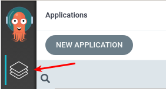
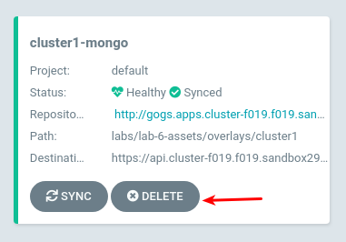
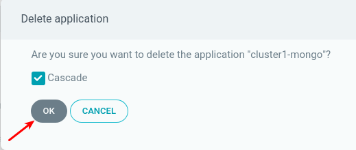

# Disaster Recovery

As we have seen, the strength of GitOps is the ability to mange application workloads and move applications between clusters.

Through the use of overlays, GitOps can be used to provide `Disaster Recovery` solutions for our applications.

In this lab we are going to see how GitOps along with our MongoDB cluster manages a failure of the primary MongoDB Replica.

## Creating some chaos

We are going to connect to the Argo CD WebUI and delete the `cluster1-mongo` application. That will simulate a failure in Cluster1.

~~~sh
# Use the `oc` command to get the ArgoCD WebUI Route hostname
oc --context cluster1 -n argocd get route argocd-server -o jsonpath="{.status.ingress[*].host}{\"\n\"}"

argocd.apps.cluster-GUID.GUID.DOMAIN
~~~

You can access to the Argo CD WebUI using your browser and the hostname returned by the command above, the login details for accessing Argo CD WebUi are as follows:

> **NOTE:** You will be prompted to accept the self-signed certificate to access the Argo CD WebUI.

* **User:** `admin`
* **Pass:** `r3dh4t1!`

Once logged follow these steps:

1. Go to Applications
   
   
2. Delete `cluster1-mongo` Application

   
   
3. After a few moments the application will be deleted, let's verify no resources are defined

   ~~~sh
   oc --context cluster1 -n mongo get deployment
   oc --context cluster1 get namespace mongo
   ~~~

> **NOTE:** If the namespace mongo gets stuck in `Terminating` status, run the following commands:

~~~sh
oc --context cluster1 get namespace mongo -o json |jq '.spec = {"finalizers":[]}' > /tmp/temp.json
curl -k -H "Content-Type: application/json" -H "Authorization: Bearer $(oc --context cluster1 whoami -t)" -k -X PUT --data-binary @/tmp/temp.json $(oc --context cluster1 whoami --show-server)/api/v1/namespaces/mongo/finalize -vvv
~~~

## Verifying Pacman Application still works

We have lost our primary MongoDB replica, but that didn't impact our application at all. Since we have three MongoDB replicas, the Pacman application can continue saving and reading high scores from the database.

You can go ahead and play Pacman, verify that high scores are saved.

## Bring the MongoDB replica back

We will re-create the MongoDB Application on Cluster1.

> **NOTE:** You can follow the MongoDB Application creation within the ArgoCD WebUI if you want

~~~sh
# Use the `argocd` binary to recreate the application in cluster1
argocd app create --project default --name cluster1-mongo --repo http://$(oc --context cluster1 -n gogs get route gogs -o jsonpath='{.spec.host}')/student/federation-dev.git --path labs/lab-6-assets/overlays/cluster1 --dest-server $(argocd cluster list | grep cluster1 | awk '{print $1}') --dest-namespace mongo --revision master --sync-policy automated
# The helper command `wait-for-argo-app` will wait until the Application is healthy in Argo CD
wait-for-argo-app cluster1-mongo
# Use the `argocd` binary to check the status of `cluster1-mongo`
argocd app get cluster1-mongo
~~~

We should see the MongoDB pod running:

~~~sh 
oc --context=cluster1 -n mongo get pods

NAME                    READY   STATUS    RESTARTS   AGE
mongo-94cdc5b6f-g8hwz   1/1     Running   0          25s
~~~

Once the pod is running the MongoDB replica will be reconfigured, we can get the new primary and secondary members by running:

~~~sh
# The helper command `wait-for-deployment` to check for the Deployment object to be in the Ready state
wait-for-deployment cluster1 mongo mongo
# The helper command `wait-for-mongo-replicaset` will wait for the MongoDB cluster to be configured
wait-for-mongo-replicaset cluster1 mongo 3
~~~

# Using Gitops to Manage GitOps

Another way to handle disaster recovery is to store the Argo CD applications within the git repository. This would allow for us to recreate assets just by applying a YAML file defining the application.

Argo CD applications can be described and exported using the `oc` binary. This output could be exported to a YAML file and stored in the git repository.

~~~sh
oc --context cluster1 -n argocd get application cluster2-pacman -o yaml --export
~~~

We will now delete the cluster2 pacman application and all of the YAML objects and then recreate them by applying a YAML file.

~~~sh
argocd app delete cluster2-pacman
~~~

Verify the items have been removed:

~~~sh
for i in svc deployment service sa; do oc get $i pacman -n pacman --context cluster2; done

Error from server (NotFound): services "pacman" not found
Error from server (NotFound): deployments.extensions "pacman" not found
Error from server (NotFound): services "pacman" not found
Error from server (NotFound): serviceaccounts "pacman" not found
~~~

We will now modify the file `labs/lab-10-assets/pacman-application.yaml` to reflect the git repository and the cluster2 url.

~~~sh
# Changer directories
cd ~/federation-dev/labs/lab-10-assets
# Define the variable of `REPO`
REPO=http://$(oc --context cluster1 -n gogs get route gogs -o jsonpath='{.spec.host}')/student/federation-dev.git
# Define the variable of `CLUSTER`
CLUSTER=$(argocd cluster list | grep cluster2 | awk '{print $1}')
# Replace the value with the variable of `REPO`
sed -i "s~repoURL: repo~repoURL: $REPO~g" pacman-application.yaml
# Replace the value with the variable of `CLUSTER`
sed -i "s~server: server~server: $CLUSTER~g" pacman-application.yaml
# Stage your changes to be sent to the git repository
git commit -am 'Argo CD managing cluster2-pacman Application'
# Push your commits to the git repository
git push origin master
~~~~

We now can use Argo CD to deploy the application within Argo CD ensuring that it is always there. By storing the Argo CD applications within git it allows us to manage the Argo CD applications in the same we manage deployments, services, and other Kubernetes objects.

~~~sh
# Use the `argocd` binary to create the application
argocd app create --project default --name argocd-applications --repo http://$(oc --context cluster1 -n gogs get route gogs -o jsonpath='{.spec.host}')/student/federation-dev.git --path labs/lab-10-assets --dest-server $(argocd cluster list | grep cluster1 | awk '{print $1}') --dest-namespace argocd --revision master --sync-policy automated
~~~

When we run the sync command the application will be created within Argo CD and then the resources for cluster2 pacman will also be created similiar to when we run the `argocd app create` command.
~~~sh
# Use the `argocd` binary to sync the `argocd-applications`
argocd app sync argocd-applications
# Use the `argocd` binary to view the status of the recreated `cluster2-pacman`
argocd app get cluster2-pacman
~~~

With this strategy all Argo CD applications that we created can be defined in YAML format and stored in git rather than using the `argocd` binary to create and define every Argo CD application.

This concludes the disaster recovery lab.

Next Lab: [Lab 11 - Wrapup](./11.md) 
Previous Lab: [Lab 9 - Canary Deployments](./9.md) 
[Home](./README.md)
