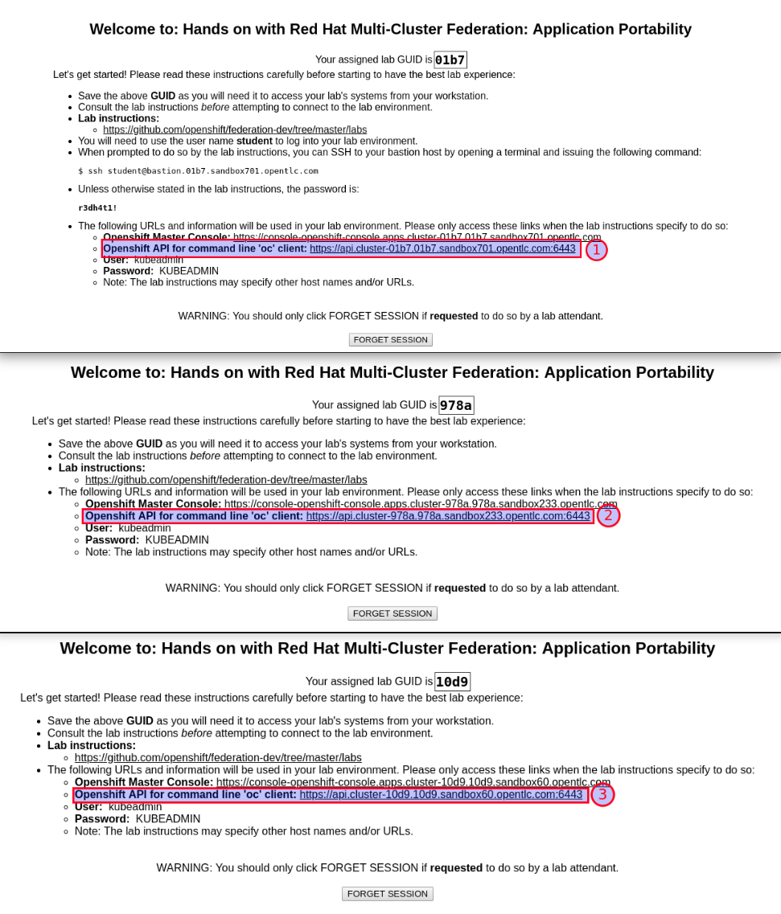

## Configure OpenShift client context for cluster admin access

You should have three environments from GuidGrabber, each environment has a different **OpenShift API for command line 'oc' client** config, make sure you
have three different API Endpoints ready for use. API Endpoints look like: `https://api.cluster-d5fe.d5fe.sandbox253.opentlc.com:6443`

e.g:

Based on the image above, our API endpoints would be:

* A0004-A cluster https://api.cluster-01b7.01b7.sandbox701.opentlc.com:6443
* A0004-B cluster https://api.cluster-978a.978a.sandbox233.opentlc.com:6443
* A0004-C cluster https://api.cluster-10d9.10d9.sandbox60.opentlc.com:6443

> **NOTE:** Below commands refer to GUID and DOMAIN. GUID refers to the environment uniq id assigned by GuidGrabber and DOMAIN refers to the environment dns domain assigned by GuidGrabber. e.g: GUID - `d5fe` DOMAIN - `sandbox253.opentlc.com`

Now, we are going to login into each cluster and rename the context. Make sure you use the correct cluster information for each login step. For example the first login will
be **A0004-A** environment, second login **A0004-B** and third login **A0004-C**.

> **NOTE:** Remember you **have to** use your own environments in commands below, **copy&paste will not work**

~~~sh
# Login into A0004-A cluster
oc login -u admin -p r3dh4t1! --insecure-skip-tls-verify https://api.cluster-GUID.GUID.DOMAIN:6443
oc config rename-context $(oc config current-context) cluster1
# Login into A0004-B cluster
oc login -u admin -p r3dh4t1! --insecure-skip-tls-verify https://api.cluster-GUID.GUID.DOMAIN:6443
oc config rename-context $(oc config current-context) cluster2
# Login into A0004-C cluster
oc login -u admin -p r3dh4t1! --insecure-skip-tls-verify https://api.cluster-GUID.GUID.DOMAIN:6443
oc config rename-context $(oc config current-context) cluster3
~~~

Verify that your contexts have been created and are working as expected by running the following command:

~~~sh
verify-contexts

[OK] Contexts cluster1, cluster2 and cluster3 detected
[OK] Contexts cluster1, cluster2 and cluster3 use different api endpoints
[OK] All checks passed
~~~

Confirm functionality of the new configured contexts. You will see that as you switch contexts and list nodes, that you are indeed switching to different clusters. Close out this validation by switching back to the `cluster1` context.

~~~sh
# Switch to cluster1
oc config use-context cluster1
# List the nodes in cluster1
oc get nodes
# Switch to cluster2
oc config use-context cluster2
# List the nodes in cluster2
oc get nodes
# Switch to cluster3
oc config use-context cluster3
# List the nodes in cluster3
oc get nodes
# Switch back to cluster1
oc config use-context cluster1
~~~

After this our current client context is `admin` in `cluster1`.

~~~sh
# List the context currently being used and the user
oc config current-context && oc whoami

cluster1
admin
~~~

The presence and unique naming of the client contexts are important because the `argocd` tool uses them to manage cluster registration, and they are referenced by context name.

Next Lab: [Lab 3 - GitOps Introduction](./3.md) 
Previous Lab: [Lab 1 - Introduction and Prerequisites](./1.md) 
[Home](./README.md)
