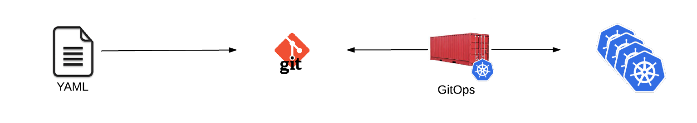

# Git Ops Introduction
Argo CD is a GitOps tool for deploying and managing Kubernetes services. The term GitOps is applied to applications or tools that are used to the deploy YAML files that are stored within a git repository. This repository can be private repository on GitHub or GitLab, on premise, or within a public git repository.  GitOps tools can be triggered to deploy or update Kubernetes objects either manually, through a webhook, or automatically. Some GitOps tools even offer the ability to prune or remove resources automatically that are not currently defined wtihin the git repository.

* Configuration is “pulled” into an environment similiar to running a `git pull` on your system
* Some tools require a component to be installed on all clusters. These tools will pull the objects into the cluster.
* Some tools do not require any remote resources to be running. Permissions are created on the remote clusters and configuration is pushed to the cluster.
* Templating available with Helm or Kustomize
* Quite simply “kubectl apply -f $path” runs over and over
* No Kubernetes object type creation limitations

## Argo CD 
Argo CD has already been predeployed for this lab. For context, we do not need to deploy Argo CD on the clusters we want to manage, we could deploy Argo CD to manage a single cluster or multiple clusters. In this lab, for convenience, we are using one of the clusters (`cluster1`) to run the Argo CD components.

## Accessing the Web UI

The Argo CD WebUI is exported using an OpenShift Route, you should be able to access the WebUI using the route hostname
returned by the command below:

~~~sh
# Request the URL of the Argo CD Application through the `OpenShift Route`
oc --context cluster1 -n argocd get route argocd-server -o jsonpath="{.status.ingress[*].host}{\"\n\"}"

argocd.apps.cluster-GUID.GUID.DOMAIN
~~~

You can access to the Argo CD WebUI using your browser and the hostname returned by the command above, the login details for accessing Argo CD WebUi are as follows:

> NOTE: You will be prompted to accept the self-signed certificate to access the Argo CD WebUI.

* **User:** `admin`
* **Pass:** `r3dh4t1!`

We won't be using the WebUI until Lab10, feel free to access the WebUI at any time to follow the application deployments.

## How-to Login to Argo CD CLI

We already setup the Argo CD Cli login for you. If you wanted to login the command you would use will be:

> **NOTE:** This section has already been done for you. These steps are just an FYI or if you are running this lab outside of the Red Hat Tech Exchange environment.

~~~sh
# Login to Argo CD using the `argocd` binary and the `OpenShift Route`
argocd --insecure --grpc-web login <argocd_server_hostname>:<argocd_server_port> --username admin --password <admin_password>
~~~

The first time you login the `admin_password` will be the `argocd-server` pod's name. 

A login example will be:

~~~sh
# Get the name of the Argo CD server pod
oc get pod -n argocd --context cluster1 | grep argocd-server
# The Argo CD server pod name is used to login to Argo CD
argocd --insecure --grpc-web login argocd.apps.cluster-c2e3.c2e3.sandbox60.opentlc.com:443 --username admin --password argocd-server-76d8b87f96-vvtzm
~~~

* `--insecure` is used so we don't get asked about non valid TLS certificates
* `--grpc-web` is used so `grpc` communications are done using HTTP protocol, this is required since OCP Router doesn't support `grpc`

**Updating Admin Password**

> **NOTE:** You don't have to update the admin password, this is only for reference. In the current environment the admin password has been set to `r3dh4t1!`

Once you're logged in, you can update the admin user password, that's done with the command below:

~~~sh
# Changing the Argo CD Password
argocd --insecure --grpc-web --server <argocd_server_hostname>:<argocd_server_port> account update-password --current-password <current_admin_password> --new-password <new_admin_password>
~~~

## Adding Clusters
There is a [bug on Argo CD affecting OpenShift Servers](https://github.com/argoproj/argo-cd/issues/1761) where you cannot add multiple clusters due to colliding secrets, a workaround exists in the lab so you don't have to deal with secret deletion.

Usually, clusters are added to Argo CD using the `argocd` tool and existing context in the `oc tool`.

~~~sh
# Add clusters to Argo CD
argocd cluster add <cluster_context_name>
~~~

> **NOTE:** https://kubernetes.default.svc will already exist as a defined cluster within Argo CD. It will use the internal kubernetes service address to interact with cluster1. For this lab we are going to add it under the name of cluster1 anyway for ease of use.

We will run the helper script that takes care of adding the clusters using the workaround:

~~~sh
# The helper script below will add clusters automatically into Argo CD for you
argocd-add-clusters
~~~

Verify the clusters are defined now within Argo CD.

~~~sh
# List the available clusters using the `argocd` binary
argocd cluster list

SERVER                                 NAME      STATUS      MESSAGE
https://api.cluster1.example.com:6443  cluster1  Successful  
https://api.cluster2.example.com:6443  cluster2  Successful  
https://api.cluster3.example.com:6443  cluster3  Successful  
https://kubernetes.default.svc                   Successful  
~~~

Next Lab: [Lab 4 - Deploying and Managing a Project with GitOps](./4.md) 
Previous Lab: [Lab 2 - Configure OpenShift client context for cluster admin access](./2.md) 
[Home](./README.md)
