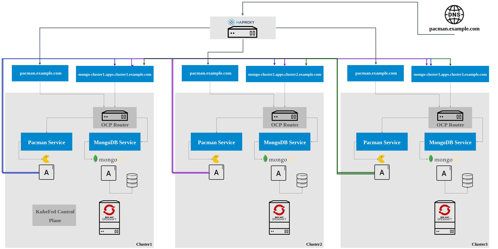

# Deploying Pacman

The files within the [directory](../automated-demo/yaml-resources/pacman) are used with the KubeFed Controller to show
Pacman running on multiple OpenShift clusters.

## Architecture

Below the architecture definition for our Pacman Application.



* There is a Pacman pod running on each OpenShift Cluster
* There is an HAProxy Load Balancer which load balances the traffic on 
`pacman.example.com` across the three Pacman replicas
* Pacman saves highscores into MongoDB, the connection string to the database includes
all the three replicas hostnames

**How a user accesses the Pacman application**

1. The user points their browser to `pacman.example.com`, the DNS server will return the IP Address of the HAProxy
2. The browser will send a request to the HAProxy asking for the host `pacman.example.com`
3. The HAProxy will lookup the available backends servers for the frontend configuration `pacman.example.com`
4. The HAProxy will reverse proxy to one of the available backends servers (pacman pods) using Round Robin as load balance mechanism
5. The user will be connected to the backend server and presented with the Pacman app

## Prerequisites

### Deploying HAProxy

We are going to deploy the HAProxy server on one of the clusters (`cluster1`), the HAProxy could be hosted externally as well.

1. Change directory to `haproxy-yaml`

    ```sh
    cd ~/federation-dev/labs/haproxy-yaml
    ```
2. Create the namespace where the HAProxy LB will be deployed
    
    ```sh
    oc --context cluster1 create ns haproxy-lb
    ```
3. Create the HAProxy Route for external access

    > **NOTE:** HAPROXY_LB_ROUTE is what the diagram shows as `pacman.example.com`

    ```sh
    HAPROXY_LB_ROUTE=pacman-multicluster.$(oc --context=cluster1 -n openshift-console get route console -o jsonpath='{.status.ingress[*].host}' | sed "s/.*\(apps.*\)/\1/g")

    cat <<-EOF | oc --context cluster1 apply -n haproxy-lb -f -
    ---
    apiVersion: route.openshift.io/v1
    kind: Route
    metadata:
      labels:
        app: haproxy-lb
      name: haproxy-lb
    spec: 
      host: ${HAPROXY_LB_ROUTE}
      port:
        targetPort: 8080
      subdomain: ""
      tls:
        insecureEdgeTerminationPolicy: Allow
        termination: edge
      to:
        kind: Service
        name: haproxy-lb-service
        weight: 100
      wildcardPolicy: None
    ---
    EOF
    ```
    > **NOTE:** The HAProxy Route will be used as the Pacman application entry point. Since we want to have HA across clusters, we will be access Pacman application using our HAProxy rather than OpenShift Routes
4. Create the configmap with the HAProxy configuration file

    ```sh
    # Export the required vars
    PACMAN_INGRESS=pacman-ingress.$(oc --context=cluster1 -n openshift-console get route console -o jsonpath='{.status.ingress[*].host}' | sed "s/.*\(apps.*\)/\1/g")
    PACMAN_CLUSTER1=pacman.$(oc --context=cluster1 -n openshift-console get route console -o jsonpath='{.status.ingress[*].host}' | sed "s/.*\(apps.*\)/\1/g")
    PACMAN_CLUSTER2=pacman.$(oc --context=cluster2 -n openshift-console get route console -o jsonpath='{.status.ingress[*].host}' | sed "s/.*\(apps.*\)/\1/g")
    PACMAN_CLUSTER3=pacman.$(oc --context=cluster3 -n openshift-console get route console -o jsonpath='{.status.ingress[*].host}' | sed "s/.*\(apps.*\)/\1/g")
    # Copy the sample configmap
    cp haproxy.tmpl haproxy
    # Update the HAProxy configuration
    sed -i "/option httpchk GET/a \ \ \ \ http-request set-header Host ${PACMAN_INGRESS}" haproxy
    sed -i "s/<pacman_lb_hostname>/${PACMAN_INGRESS}/g" haproxy
    sed -i "s/<server1_name> <server1_pacman_route>:<route_port>/cluster1 ${PACMAN_CLUSTER1}:80/g" haproxy
    sed -i "s/<server2_name> <server2_pacman_route>:<route_port>/cluster2 ${PACMAN_CLUSTER2}:80/g" haproxy
    sed -i "s/<server3_name> <server3_pacman_route>:<route_port>/cluster3 ${PACMAN_CLUSTER3}:80/g" haproxy
    # Create the configmap
    oc --context cluster1 -n haproxy-lb create configmap haproxy --from-file=haproxy
    ```
    > **NOTE:** If you are curious about the HAProxy configuration, you can have a look at the `haproxy` file and review the frontend and backend sections
5. Create the HAProxy Service referenced in the HAProxy Route

    ```sh
    oc --context cluster1 -n haproxy-lb create -f haproxy-clusterip-service.yaml
    ```
6. Create the HAProxy Deployment

    ```sh
    oc --context cluster1 -n haproxy-lb create -f haproxy-deployment.yaml
    ```
7. Verify HAProxy is working

    7.1 Wait for HAProxy deployment to be ready

    ```sh
    wait-for-deployment cluster1 haproxy-lb haproxy-lb

    Checking if deployment haproxy-lb from namespace haproxy-lb on cluster cluster1 is ready
    <OUTPUT_OMITTED>
    Deployment is ready
    ```
    7.2 Try to access HAProxy

    > **NOTE:** 503 Service Unavailable means that no backend servers are available to handle HAProxy forwarded requests, but HAProxy is working fine.
    
    ```sh
    # Get the HAProxy LB Route
    HAPROXY_LB_ROUTE=$(oc --context cluster1 -n haproxy-lb get route haproxy-lb -o jsonpath='{.status.ingress[*].host}')
    # Access HAProxy
    curl -k https://${HAPROXY_LB_ROUTE}

    <html><body><h1>503 Service Unavailable</h1>
    No server is available to handle this request.
    </body></html>
    ```

## Deploying the Pacman Application

Now that the Mongo cluster has been configured, it is time to deploy the *pacman* application.

First, change to the directory of the Pacman demo folder.
~~~sh
cd ~/federation-dev/labs/pacman-yaml
~~~

The pacman namespace must be created and then defined as a federated namespace.
~~~sh
oc --context=cluster1 create ns pacman
kubefedctl federate namespace pacman --host-cluster-context cluster1
~~~

Validate the namespace exists in the three clusters.
~~~sh
for i in cluster1 cluster2 cluster3; do oc get namespace pacman --context $i; done

NAME    STATUS   AGE
pacman   Active   8s
NAME    STATUS   AGE
pacman   Active   4s
NAME    STATUS   AGE
pacman   Active   6s
~~~

For the *pacman* application, the file `pacman-federated-deployment-rs.yaml` needs to reflect the MongoDB endpoint. The MongoDB endpoint is used to save scores from the game.
Provide the value of the MongoDB server(s) to be used for the scores to be recorded for the *pacman* game.

~~~sh
MONGO_CLUSTER1=$(oc --context=cluster1 -n mongo get route mongo -o jsonpath='{.status.ingress[*].host}')
MONGO_CLUSTER2=$(oc --context=cluster2 -n mongo get route mongo -o jsonpath='{.status.ingress[*].host}')
MONGO_CLUSTER3=$(oc --context=cluster3 -n mongo get route mongo -o jsonpath='{.status.ingress[*].host}')
sed -i "s/replicamembershere/${MONGO_CLUSTER1},${MONGO_CLUSTER2},${MONGO_CLUSTER3}/g" 07-pacman-federated-deployment-rs.yaml
~~~

A value must be provided to be the publicly accessible address for the *pacman* application.
~~~sh
PACMAN_INGRESS=pacman-ingress.$(oc --context=cluster1 -n openshift-console get route console -o jsonpath='{.status.ingress[*].host}' | sed "s/.*\(apps.*\)/\1/g")
sed -i "s/pacmanhosthere/${PACMAN_INGRESS}/g" 03-pacman-federated-ingress.yaml
~~~

Now that the yaml files contain the MongoDB endpoints and the Pacman LB route it is time to deploy the objects.

1. Create the FederatedSecret containing the secret to access MongoDB 

    ~~~sh
    oc --context cluster1 create -n pacman -f 01-mongo-federated-secret.yaml
    ~~~
2. Create the FederatedService that will create a `ClusterIP Service` for Pacman

    ~~~sh
    oc --context cluster1 create -n pacman -f 02-pacman-federated-service.yaml
    ~~~
3. Create the FederatedIngress that will create a `Ingress` for Pacman on each cluster (ingress-to-route controller will create an OpenShift Route automatically)

    ~~~sh
    oc --context cluster1 create -n pacman -f 03-pacman-federated-ingress.yaml
    ~~~
4. Create the FederatedServiceAccount that will be used to run the Pacman pods

    ~~~sh
    oc --context cluster1 create -n pacman -f 04-pacman-federated-service-account.yaml
    ~~~
5. Create the FederatedClusterRole that will be used by Pacman ServiceAccount to access OpenShift API data

    ~~~sh
    oc --context cluster1 create -n pacman -f 05-pacman-federated-cluster-role.yaml
    ~~~
6. Create the FederatedClusterRoleBinding that will grant the FederatedClusterRole to the Pacman ServiceAccount

    ~~~sh
    oc --context cluster1 create -n pacman -f 06-pacman-federated-cluster-role-binding.yaml
    ~~~
7. Create the FederatedDeployment that will create a `Deployment` which deploys Pacman application

    ~~~sh
    oc --context cluster1 create -n pacman -f 07-pacman-federated-deployment-rs.yaml
    ~~~
8. Wait for the deployment to become ready

    ~~~sh
    for cluster in cluster1 cluster2 cluster3; do wait-for-deployment $cluster pacman pacman;done

    Checking if deployment pacman from namespace pacman on cluster cluster1 is ready
    <OUTPUT_OMITTED>
    Deployment is ready
    Checking if deployment pacman from namespace pacman on cluster cluster2 is ready
    <OUTPUT_OMITTED>
    Deployment is ready
    Checking if deployment pacman from namespace pacman on cluster cluster3 is ready
    <OUTPUT_OMITTED>
    Deployment is ready
    ~~~

## Play the Game
The game should be available now at the publicly accessible address. Make sure to save the high score at the end of the game. This shows the data being persisted back to the database.

You can go ahead and open the url returned by the following command in your browser:

~~~sh
oc --context=cluster1 -n haproxy-lb get route haproxy-lb -o jsonpath='{.status.ingress[*].host}'

e.g: pacman-multicluster.apps.cluster-b5b7.b5b7.sandbox362.opentlc.com
~~~

If a mistake was made, please let an instructor know, and review the [cleanup instructions](./cleanup-instructions.md).

Next Lab: [Lab 7 - Application Portability ](./7.md)<br>
Previous Lab: [Lab 5 - Deploying MongoDB](./5.md)<br>
[Home](./README.md)
