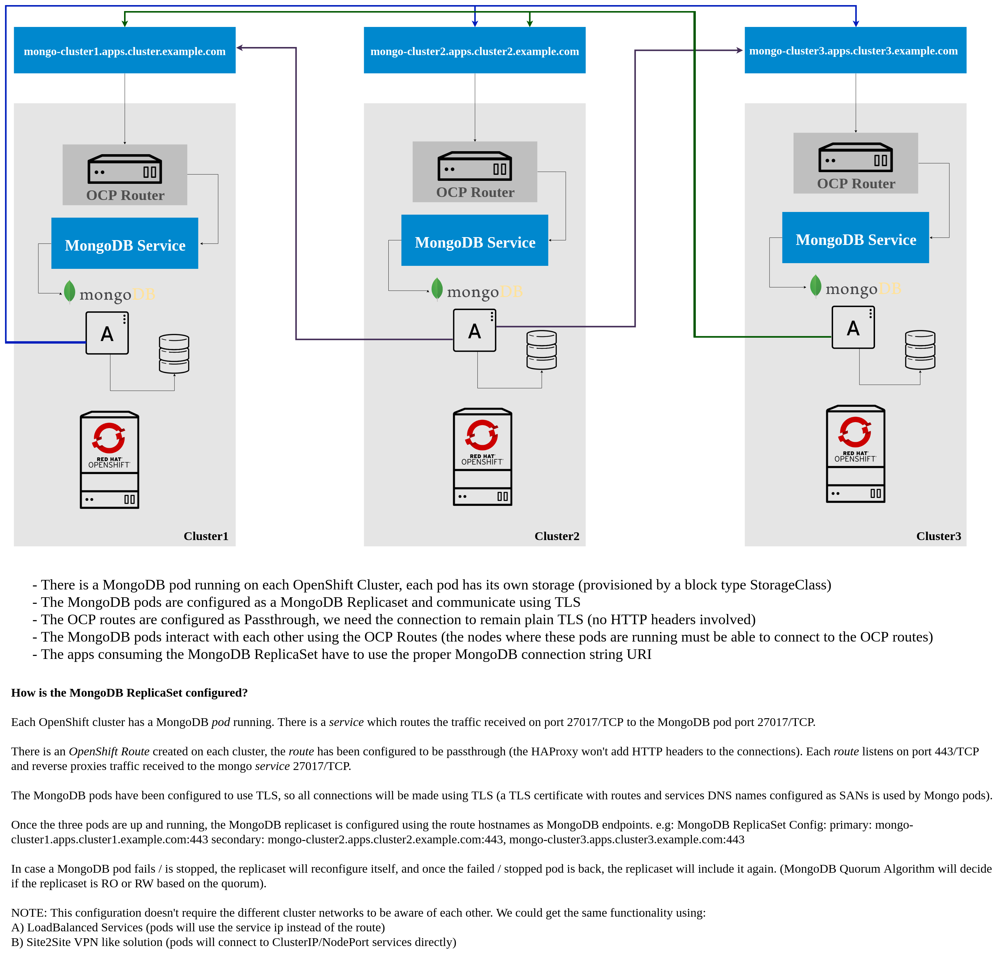

# Deploying MongoDB

The files within the [directory](./lab-6-assets) are used to deploy
MongoDB. We will define all 3 clusters that are defined within Argo CD.

## Architecture

Shown below is the architecture definition for our MongoDB Cluster.

* There is a MongoDB pod running on each OpenShift Cluster, each pod has its own storage (provisioned by a block type StorageClass)
* The MongoDB pods are configured as a MongoDB ReplicaSet and communicate using TLS
* The OCP routes are configured as Passthrough, we need the connection to remain plain TLS (no HTTP headers involved)
* The MongoDB pods interact with each other using the OCP Routes (the nodes where these pods are running must be able to connect to the OCP routes)
* The apps consuming the MongoDB ReplicaSet have to use the proper MongoDB connection string URI

**How is the MongoDB ReplicaSet configured?**

Each OpenShift cluster has a MongoDB _pod_ running. There is a _service_ which routes the traffic received on port 27017/TCP to the MongoDB pod port 27017/TCP.

There is an _OpenShift Route_ created on each cluster, the _route_ has been configured to be passthrough (the HAProxy Router won't add HTTP headers to the connections). Each _route_ listens on port 443/TCP and reverse proxies traffic received to the mongo _service_ 27017/TCP.

The MongoDB pods have been configured to use TLS, so all connections will be made using TLS (a TLS certificate with routes and services DNS names configured as SANs is used by MongoDB pods).

Once the three pods are up and running, the MongoDB ReplicaSet is configured using the route hostnames as MongoDB endpoints. e.g:

Primary Replica: mongo-cluster1.apps.cluster1.example.com:443 
Secondary Replicas: mongo-cluster2.apps.cluster2.example.com:443, mongo-cluster3.apps.cluster3.example.com:443

In case a MongoDB pod fails / is stopped, the ReplicaSet will reconfigure itself, and once the failed / stopped pod is back, the ReplicaSet will include it again. (MongoDB Quorum Algorithm will decide if the ReplicaSet is RO or RW based on the quorum).

**NOTE:** This configuration doesn't require the different cluster networks to be aware of each other. We could get the same functionality using:

A) LoadBalancer Services (pods will use the service ip instead of the OpenShift Route) 
B) Site2Site VPN like solution (pods will connect to ClusterIP / NodePort services directly)

## Prerequisites

### Creating Certificates
This demonstration uses MongoDB with TLS enabled. The example below will create a
generic CA, key, and certificate. 

Follow the steps below to create the required files in the `mongo-yaml` directory:

1. Change directory to `lab-6-assets`

    ~~~sh
    cd ~/federation-dev/labs/lab-6-assets
    ~~~

2. Create the file `ca-config.json`:

    ~~~sh
    cat > ca-config.json <<EOF
    {
      "signing": {
        "default": {
          "expiry": "8760h"
        },
        "profiles": {
          "kubernetes": {
            "usages": ["signing", "key encipherment", "server auth", "client auth"],
            "expiry": "8760h"
          }
        }
      }
    }
    EOF
    ~~~
3. Create the file `ca-csr.json`

    ~~~sh
    cat > ca-csr.json <<EOF
    {
      "CN": "Kubernetes",
      "key": {
        "algo": "rsa",
        "size": 2048
      },
      "names": [
        {
          "C": "US",
          "L": "Austin",
          "O": "Kubernetes",
          "OU": "TX",
          "ST": "Texas"
        }
      ]
    }
    EOF
    ~~~
4. Create the file `mongodb-csr.json`

    ~~~sh
    cat > mongodb-csr.json <<EOF
    {
      "CN": "kubernetes",
      "key": {
        "algo": "rsa",
        "size": 2048
      },
      "names": [
        {
          "C": "US",
          "L": "Austin",
          "O": "Kubernetes",
          "OU": "TX",
          "ST": "Texas"
        }
      ]
    }
    EOF
    ~~~

We will use OpenShift Routes to provide connectivity between MongoDB Replicas. As we said before, MongoDB will be configured to use TLS communications, we need to generate certificates with proper hostnames configured within them.

Follow the instructions below to generate a PEM file which include:
* MongoDB's Certificate Private Key
* MongoDB's Certificate Public Key

1. Generate the CA

    ~~~sh
    cfssl gencert -initca ca-csr.json | cfssljson -bare ca
    ~~~
2. Export some variables with information that will be used for generate the certificates

    ~~~sh
    # Define the `NAMESPACE` variable
    NAMESPACE=mongo
    # Define the `SERVICE_NAME` variable
    SERVICE_NAME=mongo
    # Define the variable of `ROUTE_CLUSTER1`
    ROUTE_CLUSTER1=mongo-cluster1.$(oc --context=cluster1 get ingresses.config.openshift.io cluster -o jsonpath='{ .spec.domain }')
    # Define the variable of `ROUTE_CLUSTER2`
    ROUTE_CLUSTER2=mongo-cluster2.$(oc --context=cluster2 get ingresses.config.openshift.io cluster -o jsonpath='{ .spec.domain }')
    # Define the variable of `ROUTE_CLUSTER3`
    ROUTE_CLUSTER3=mongo-cluster3.$(oc --context=cluster3 get ingresses.config.openshift.io cluster -o jsonpath='{ .spec.domain }')
    # Define the variable of `SAN`
    SANS="localhost,localhost.localdomain,127.0.0.1,${ROUTE_CLUSTER1},${ROUTE_CLUSTER2},${ROUTE_CLUSTER3},${SERVICE_NAME},${SERVICE_NAME}.${NAMESPACE},${SERVICE_NAME}.${NAMESPACE}.svc.cluster.local"
    ~~~
3. Generate the MongoDB Certificates

    ~~~sh
    cfssl gencert -ca=ca.pem -ca-key=ca-key.pem -config=ca-config.json -hostname=${SANS} -profile=kubernetes mongodb-csr.json | cfssljson -bare mongodb
    ~~~
4. Combine Key and Certificate

    ~~~sh
    cat mongodb-key.pem mongodb.pem > mongo.pem
    ~~~

### Update MongoDB yaml files

The lab content provides the required files for deploying the MongoDB cluster members in YAML format. We will modify specific values and then commit them to our git repo and use Argo CD to deploy them.

Before deploying MongoDB the yaml files need to be updated to define the certificates that
were created and routing endpoints that will be used.

1. Configure `MongoDB's PEM`

    ~~~sh
    # Place the value of the `mongodb.pem` into the `mongo-secret.yaml`
    sed -i "s/mongodb.pem: .*$/mongodb.pem: $(openssl base64 -A < mongo.pem)/" base/mongo-secret.yaml
    # Place the value of the `ca.pem` into the `mongo-secret.yaml`
    sed -i "s/ca.pem: .*$/ca.pem: $(openssl base64 -A < ca.pem)/" base/mongo-secret.yaml
    ~~~
2. Configure `MongoDB's Endpoints`

    ~~~sh
    # Place the value of `ROUTE_CLUSTER1` in the `mongo-rs-deployment.yaml` file
    sed -i "s/primarynodehere/${ROUTE_CLUSTER1}:443/" base/mongo-rs-deployment.yaml
    # Place the value of `ROUTE_CLUSTER1`, `ROUTE_CLUSTER2, and `ROUTE_CLUSTER3` in the `mongo-rs-deployment.yaml` file
    sed -i "s/replicamembershere/${ROUTE_CLUSTER1}:443,${ROUTE_CLUSTER2}:443,${ROUTE_CLUSTER3}:443/" base/mongo-rs-deployment.yaml
    ~~~

3. Configure `MongoDB OpenShift Route Names`

    ~~~sh
    # Replace the value of changme with `ROUTE_CLUSTER1` in the file `mongo-route.yaml`
    sed -i "s/mongocluster1route/${ROUTE_CLUSTER1}/" overlays/cluster1/mongo-route.yaml
    # Replace the value of changme with `ROUTE_CLUSTER2` in the file `mongo-route.yaml`
    sed -i "s/mongocluster2route/${ROUTE_CLUSTER2}/" overlays/cluster2/mongo-route.yaml
    # Replace the value of changme with `ROUTE_CLUSTER3` in the file `mongo-route.yaml`
    sed -i "s/mongocluster3route/${ROUTE_CLUSTER3}/" overlays/cluster3/mongo-route.yaml
    ~~~

4. Commit the changes

   ~~~sh
   # Stage your changes to be sent to the git repository
   git commit -am 'MongoDB Certificates and MongoDB Routes'
   # Push your commits to the git repository
   git push origin master
   ~~~

## Deploying the MongoDB Cluster
Similar to the previous labs we need to define the app within Argo CD.

~~~sh
# Use the `argocd` binary to create the application in cluster1
argocd app create --project default --name cluster1-mongo \
  --repo http://$(oc --context cluster1 -n gogs get route gogs -o jsonpath='{.spec.host}')/student/federation-dev.git \
  --path labs/lab-6-assets/overlays/cluster1 \
  --dest-server $(argocd cluster list | grep cluster1 | awk '{print $1}') \
  --dest-namespace mongo --revision master --sync-policy automated

# Use the `argocd` binary to create the application in cluster2
argocd app create --project default --name cluster2-mongo \
  --repo http://$(oc --context cluster1 -n gogs get route gogs -o jsonpath='{.spec.host}')/student/federation-dev.git \
  --path labs/lab-6-assets/overlays/cluster2 \
  --dest-server $(argocd cluster list | grep cluster2 | awk '{print $1}') \
  --dest-namespace mongo --revision master --sync-policy automated

# Use the `argocd` binary to create the application in cluster3
argocd app create --project default --name cluster3-mongo \
  --repo http://$(oc --context cluster1 -n gogs get route gogs -o jsonpath='{.spec.host}')/student/federation-dev.git \
  --path labs/lab-6-assets/overlays/cluster3 \
  --dest-server $(argocd cluster list | grep cluster3 | awk '{print $1}') \
  --dest-namespace mongo --revision master --sync-policy automated
~~~

To help verify and speed up the deployment process we will use the sync command to verify that the items are deployed as expected.

~~~sh
# The helper command `wait-for-argo-app` will wait until the Application is healthy in Argo CD
wait-for-argo-app cluster1-mongo
# Use the `argocd` binary to check the status of `cluster1-mongo`
argocd app sync cluster1-mongo
# The helper command `wait-for-argo-app` will wait until the Application is healthy in Argo CD
wait-for-argo-app cluster2-mongo
# Use the `argocd` binary to check the status of `cluster2-mongo`
argocd app sync cluster2-mongo
# The helper command `wait-for-argo-app` will wait until the Application is healthy in Argo CD
wait-for-argo-app cluster3-mongo
# Use the `argocd` binary to check the status of `cluster3-mongo`
argocd app sync cluster3-mongo
~~~

Validate the namespace exists in the three clusters.
~~~sh
# The for loop below will show the status of the namespace on the three clusters
for cluster in cluster1 cluster2 cluster3; do oc --context $cluster get namespace mongo; done

NAME    STATUS   AGE
mongo   Active   6s
NAME    STATUS   AGE
mongo   Active   5s
NAME    STATUS   AGE
mongo   Active   5s
~~~

Verify `OpenShift Routes` creation.

~~~sh
# The for loop below will display the route on the three clusters
for cluster in cluster1 cluster2 cluster3; do oc --context $cluster -n mongo get route mongo; done
~~~

## Configuring MongoDB ReplicaSet

At this point we should have 3 independent MongoDB instances running, one on each cluster. Let's verify all replicas are up and running. 

>  **NOTE:** This may take a minute or two

~~~sh
# The for loop uses the helper command `wait-for-deployment` to check for the Deployment object to be in the Ready state
for cluster in cluster1 cluster2 cluster3; do wait-for-deployment $cluster mongo mongo; done

Checking if deployment mongo from namespace mongo on cluster cluster1 is ready
<OUTPUT_OMITTED>
Deployment is ready
Checking if deployment mongo from namespace mongo on cluster cluster2 is ready
<OUTPUT_OMITTED>
Deployment is ready
Checking if deployment mongo from namespace mongo on cluster cluster3 is ready
<OUTPUT_OMITTED>
Deployment is ready
~~~

Now that all replicas are up and running we are going to configure a MongoDB ReplicaSet so all three replicas work as a cluster.
This procedure has been automated and you only need to add a label to the MongoDB Pod you want to act as primary replica. We are going to use the pod running on `cluster1` as primary replica.

~~~sh
# Select Primary MongoDB pod
MONGO_POD=$(oc --context=cluster1 -n mongo get pod --selector="name=mongo" --output=jsonpath='{.items..metadata.name}')
# Label primary pod
oc --context=cluster1 -n mongo label pod $MONGO_POD replicaset=primary
~~~

The MongoDB ReplicaSet is being configured now, let's wait for it to be configured and check the ReplicaSet Status to ensure it has been properly configured.

>  **NOTE:** You should see one primary replica and two secondary replicas on the output from the command below

~~~sh
# The helper command `wait-for-mongo-replicaset` will wait for the MongoDB cluster to be configured
wait-for-mongo-replicaset cluster1 mongo 3

Checking if MongoDB Replicaset from namespace mongo on cluster cluster1 is configured
<OUTPUT_OMITTED>

MongoDB ReplicaSet Status:
--------------------------
Primary Member:
"mongo-cluster1.apps.cluster1.example.com:443"
Secondary Members:
"mongo-cluster2.apps.cluster2.example.com:443"
"mongo-cluster3.apps.cluster3.example.com:443"
~~~

If you want to get a more detailed view of the configuration, you can run the following command and you will get a huge json output with the status of the ReplicaSet:

~~~sh
# Select Primary MongoDB pod
MONGO_POD=$(oc --context=cluster1 -n mongo get pod --selector="name=mongo" --output=jsonpath='{.items..metadata.name}')
# Get replicaset status
oc --context=cluster1 -n mongo exec $MONGO_POD \
  -- bash -c 'mongo --norc --quiet --username=admin --password=$MONGODB_ADMIN_PASSWORD --host localhost admin --tls --tlsCAFile /opt/mongo-ssl/ca.pem --eval "rs.status()"'
~~~

This concludes the deployment of MongoDB using Argo CD.

If a mistake was made, please let an instructor know, and review the [cleanup instructions](./cleanup-instructions.md).

Next Lab: [Lab 7 - Deploying Pacman](./7.md) 
Previous Lab: [Lab 5 - Customizing deployments](./5.md) 
[Home](./README.md)

