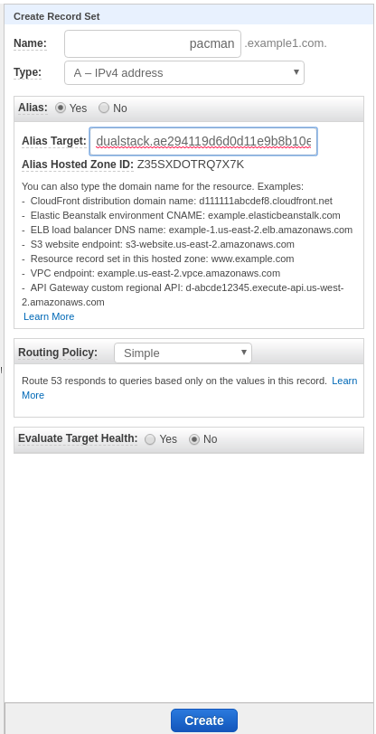

## Deploying *Pacman*
Now that the Mongo cluster has been configured, it is time to deploy the *pacman* application.
There are many different types of federated objects but they are somewhat similar to those
non-federated objects. For more information about federated objects see the following  [examples](https://github.com/kubernetes-sigs/kubefed/tree/master/example/sample1) and
the [user guide](https://github.com/kubernetes-sigs/kubefed/blob/master/docs/userguide.md).

The pacman namespace must be created and then defined as a federated namespace.
~~~sh
oc create ns pacman
kubefedctl federate namespace pacman
~~~

Validate the namespace exists in the three clusters.
~~~sh
for i in cluster1 cluster2 cluster3; do oc get project pacman --context $i; done
NAME     DISPLAY NAME   STATUS
pacman                  Active
NAME     DISPLAY NAME   STATUS
pacman                  Active
NAME     DISPLAY NAME   STATUS
pacman                  Active
~~~

Modify the cluster names to reflect the names of the kubefedclusters defined above.
~~~sh
cd federation-dev/labs/pacman-yaml
sed -i 's/feddemocl1/cluster1/g' ./*.yaml
sed -i 's/feddemocl2/cluster2/g' ./*.yaml
sed -i 's/feddemocl3/cluster3/g' ./*.yaml
~~~

For the *pacman* application, the file `pacman-federated-deployment-rs.yaml` needs to reflect the MongoDB endpoint. The MongoDB endpoint is used to save scores from the game.
Provide the value of the MongoDB server(s) to be used for the scores to be recorded
for the *pacman* game.

### Will be patched when Mario finished AGNOSTICD
~~~sh
sed -i 's/replicamembershere/mongo-cluster1.apps.cluster-1.example1.com,mongo-cluster2.app.ccluster2.example1.com,mongo-cluster3.apps.cluster3.example1.com/g' 07-pacman-federated-deployment-rs.yaml
~~~

A value must be provided to be the publicly accessible address for the *pacman* application.
~~~sh
sed -i 's/pacmanhosthere/pacman.example1.com/g' 03-pacman-federated-ingress.yaml
~~~

Now deploy the *pacman* objects.
~~~sh
# Create the MongoDB secret
oc create -n pacman -f 01-mongo-federated-secret.yaml
# Create the service
oc create -n pacman -f 02-pacman-federated-service.yaml
# Create the ingress endpoint
oc create -n pacman -f 03-pacman-federated-ingress.yaml
# Create the pacman service serviceaccount
oc create -n pacman -f 04-pacman-federated-service-account.yaml
# Create the pacman cluster role
oc create -n pacman -f 05-pacman-federated-cluster-role.yaml
# Create the clusterrolebinding
oc create -n pacman -f 06-pacman-federated-cluster-role-binding.yaml
# Create the deployment
oc create -n pacman -f 07-pacman-federated-deployment-rs.yaml
~~~

## Deploying HAProxy
### THIS WILL BE PATCHED WITH MARIO FINISHIED UP AGNOSTICD

Due to DNS TTLs, HAProxy is used to manage traffic of the *pacman* application
running on the different clusters. The use of HAProxy allows for faster failover
than TTLs can. This lowers the potential downtime when moving the *pacman* application
on and off of clusters.

A `configmap` will define the endpoints that were created when we created the ingress endpoint
using `03-pacman-federated-ingress.yaml`

A value must be provided to be the publicly accessible address for the *pacman* application. Also,
it is required to specify the cluster and the address of the *pacman* application which is routed by the OpenShift
router.
~~~sh
cd ../haproxy-yaml
cp haproxy.tmpl haproxy
sed -i 's/<pacman_lb_hostname>/pacman.example1.com/g' haproxy
sed -i 's/<server1_name> <server1_pacman_route>:<route_port>/cluster3 pacman.apps.west-2.example1.com:80/g' haproxy
sed -i 's/<server2_name> <server2_pacman_route>:<route_port>/cluster2 pacman.apps.east-2.example1.com:80/g' haproxy
sed -i 's/<server3_name> <server3_pacman_route>:<route_port>/cluster1 pacman.apps.east-1.example1.com:80/g' haproxy
~~~

Create the `configmap` to be used by the HAProxy `deploymentconfig`.
~~~sh
oc create -n pacman configmap haproxy --from-file=haproxy
~~~

A load balancer `service` is used to create a cloud provider load balancer. The Load balancer provides a publicly
available endpoint that can be used to assign a DNS A record.
~~~sh
# Create the HAProxy service
oc -n pacman create -f haproxy-service.yaml
# Create the HAProxy deployment
oc -n pacman create -f haproxy-deployment.yaml
~~~

## DNS
### THIS WILL BE PATCHED WITH MARIO FINISHIED UP AGNOSTICD
This demonstration uses Route53 for DNS. The first step is to look up the value of
the load balancer service and then assign a DNS A record.
~~~sh
oc -n pacman get svc haproxy-lb-service
NAME         TYPE           CLUSTER-IP       EXTERNAL-IP                                                               PORT(S)        AGE
haproxy-lb-service   LoadBalancer   172.31.161.224   ae294119d6d0d11e9b8b10e1ce99fb1b-1020848795.us-east-1.elb.amazonaws.com   80:31587/TCP   86m
~~~

The next step is to provide the load balancer `EXTERNAL-IP` to a the DNS zone to allow for routing.

NOTE: The A record will point to the publicly accessible address for the *pacman* application.

Enter the value of the publicly accessible address and use an Alias to point to the
`haproxy-lb` load balancer `ELB`.

## Play the Game
The game should be available now at the publicly accessible address. Make sure to
save the high score at the end of the game. This shows the data being persisted back to
the database.

Next Lab: [Lab 8 - Application Portability ](./8.md) 
Previous Lab: [Lab 6 - Kubeconfig, Tools and Join Clusters](./6.md) 
[Home](../README.md)
