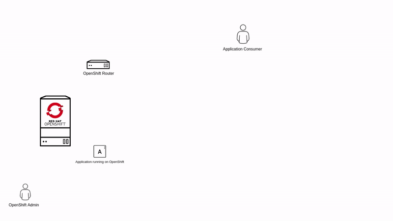

# HAProxy Tech Details

If you are reading this, probably you are curious enough to understand how we configured global ingress for this lab.

Keep in mind the solution used here is far from perfect, and we have used what the environment offered to us in order to
make it easy for you to get global ingress in the lab.

## Environment Details

We have three OpenShift Clusters, each cluster has its own OpenShift Router which handles external ingress traffic, the animation below depicts how 
external traffic is managed by the OpenShift Router.

In our lab environment we will have three different clusters, each cluster will have a Pacman replica running on it. On top of that each router for each cluster will have a Pacman Application Route published in the embedded HAProxy. 

As we want to provide Global Ingress capabilities, we need something that load balances the traffic to the different Pacman replicas, for such task we are deploying a custom HAProxy deployment on one of the clusters (`cluster1`).

## HAProxy Configuration

The HAProxy configuration for the custom HAProxy deployment used in the lab environment is as follows:

~~~
#---------------------------------------------------------------------
# main frontend which proxys to the backends
#---------------------------------------------------------------------
frontend  main
    bind *:8080

    default_backend             app

#---------------------------------------------------------------------
# round robin balancing between the various backends
#---------------------------------------------------------------------
backend app
    balance roundrobin
    option httpchk GET / HTTP/1.1\r\nHost:\ pacman-ingress.apps.cluster-05cb.05cb.sandbox605.opentlc.com
    http-request set-header Host pacman-ingress.apps.cluster-05cb.05cb.sandbox605.opentlc.com
    mode http 
        server cluster1 pacman.apps.cluster-05cb.05cb.sandbox605.opentlc.com:80 check
        server cluster2 pacman.apps.cluster-9f73.9f73.sandbox572.opentlc.com:80 check
        server cluster3 pacman.apps.cluster-7601.7601.sandbox167.opentlc.com:80 check
~~~

We have a `frontend` listening on port 8080 that defaults to the `backend` named app.

The backend `app` has some configurations that we are going to explain in next sections.

## Lab Use Case

We are deploying the HAProxy on OpenShift Cluster `cluster1`, then we are exposing that HAProxy using an OpenShift Route.

Our Pacman replicas are deployed across all three clusters, we expose them on their respective OpenShift Routers using a _FAKE_ hostname. We need all the Pacman replicas exposed using the same hostname so the HAProxy configuration we are using works.

The idea here is:

Consumer request HAProxy LB hostname -> HAProxy load balances the traffic across the different Pacman replicas.

## How we do it

We expose the custom HAProxy deployment using a hostname that will be used by consumers to access Pacman, in this case the hostname is `pacman-multicluster.apps.cluster-1050.1050.sandbox373.opentlc.com `.

The we have the _FAKE_ hostname used to publish the Pacman app in all OpenShift Routers, in this case the hostname is `pacman-ingress.apps.cluster-05cb.05cb.sandbox605.opentlc.com`.

In order to configure the `backend` for our custom HAProxy what we do is basically configuring 3 servers with a hostname that resolves to each cluster OCP Router, since we are using a wildcard domain, anything followed by `.apps.clustername.clusterdomain` will resolve the router. In our configuration you can see the three servers defined as follows:

~~~
server cluster1 pacman.apps.cluster-05cb.05cb.sandbox605.opentlc.com:80 check
server cluster2 pacman.apps.cluster-9f73.9f73.sandbox572.opentlc.com:80 check
server cluster3 pacman.apps.cluster-7601.7601.sandbox167.opentlc.com:80 check
~~~

So basically, we have three backend servers, each points to the specific cluster OpenShift Router. But that hostname is not published in any OpenShift Router, if you remember, we published the hostname `pacman-ingress.apps.cluster-05cb.05cb.sandbox605.opentlc.com` in all clusters.

Here is where things start to get ugly.

If you look at the animation above, you will see that the way HAProxy decides where to reverse proxy the traffic is looking at the `Host` HTTP Header, let's see that in action:

**Trying to access Pacman**

We said that we will get to the OpenShift Router if we use anything followed by the wildcard domain, so let's take Cluster1 wildcard domain and put "pacman" in front of it, the end result is `pacman.apps.cluster-05cb.05cb.sandbox605.opentlc.com`.

Let's access Pacman without changing the Host Header:

~~~sh
curl -sI http://pacman.apps.cluster-05cb.05cb.sandbox605.opentlc.com

HTTP/1.0 503 Service Unavailable
~~~

The OpenShift Router is returning 503 because it doesn't know about anything published with that hostname, that's right... remember that we used `pacman-ingress.apps.cluster-05cb.05cb.sandbox605.opentlc.com`.

Easy-peasy, let's change the Host Header for our connection and use the one we used to publish the application:

~~~sh
curl -sI -H 'Host: pacman-ingress.apps.cluster-05cb.05cb.sandbox605.opentlc.com' http://pacman.apps.cluster-05cb.05cb.sandbox605.opentlc.com

HTTP/1.1 200 OK
~~~

Yay! We reached the Pacman application, but why? - We sent the Host Header with the hostname that we used to publish the Pacman application on the OpenShift Router, the Router has read that information and replied back with the application.

That works exactly the same for all clusters:

~~~sh
# Cluster2
curl -sI -H 'Host: pacman-ingress.apps.cluster-05cb.05cb.sandbox605.opentlc.com' http://pacman.apps.cluster-9f73.9f73.sandbox572.opentlc.com

# Cluster3
curl -sI -H 'Host: pacman-ingress.apps.cluster-05cb.05cb.sandbox605.opentlc.com' http://pacman.apps.cluster-7601.7601.sandbox167.opentlc.com
~~~

Okay, so now we know how to "trick" the OpenShift Router so it returns the correct information, now we need to "teach" our custom HAProxy Deployment to do the same.

**Custom HAProxy Host Header Specific Configuration**

First thing we need to do is configuring HAProxy to use a custom Host Header when checking if the backend servers are up, that is done by setting up this config:

~~~
option httpchk GET / HTTP/1.1\r\nHost:\ pacman-ingress.apps.cluster-05cb.05cb.sandbox605.opentlc.com
~~~

Here we are basically telling HAProxy to send that Host Header when checking the backend servers in order to know if they are serving our application.

So now HAProxy can detect if our backend servers (Pacman Pods) are up or down, but we need HAProxy to use the correct Host Header when reverse proxying the traffic to the application, that is done by setting up this config:

~~~
http-request set-header Host pacman-ingress.apps.cluster-05cb.05cb.sandbox605.opentlc.com
~~~

That basically tells HAProxy to send that Host Header when connecting to the backend servers to gather the information before sending it back to us (consumers).

## Where we failed

At the beginning we used to deploy the HAProxy outside of the cluster, so we used the HAProxy external name (created in an external DNS server) to publish all the pacman replicas in the different clusters, so we had a setup like this:

`pacman-multicluster.example.com` pointed to the HAProxy deployed outside of the cluster, and that same hostname was used for publishing the Pacman replicas in the different OpenShift Routers, so we only needed to use the `option httpchk` for sending a custom header when checking the backend servers status.

When we tried to access the application everything worked fine, because the hostname `pacman-multicluster.example.com` was sent as Host Header to the backend servers.

When we moved the HAProxy deployment inside the cluster we find out that we need different routes, one for publishing the HAProxy to the outside world and another for publishing the Pacman replicas in the different OpenShift Routers, otherwise as we are using one of the clusters to host the HAProxy, one of the routes will fail as the hostname would be already claimed.

Here is where the option `http-request set-header Host` helped us to reach the backend servers with the hostname used for publishing the Pacman replicas.